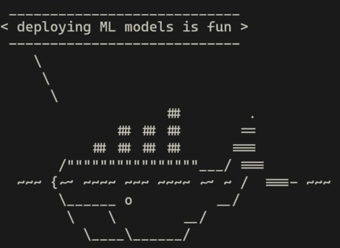

# Ungraded Labs: Intro to Docker and installation

Welcome to the first week of the final course of the Machine Learning Engineering for Production specialization. During this lab and several of ones after, you will learn different techniques that will allow you to deploy your Machine Learning models. **This is a crucial step because models are usually most useful when they interact with the outside world**. There is a knowledge gap from successfully training a model in a local environment and actually serving it. That is what these ungraded labs are for. 

---------
## Docker
These ungraded labs will be using [Docker](https://www.docker.com/) extensively. As a result of this, most of them will **require you to run the code in your local machine as Coursera currently has no support for Docker**. 

### Why Docker?

Docker is an amazing tool that allows you to **ship your software along with all of its dependencies**. This is great because it enables you to run software even without installing the required interpreters or compilers for it to run. 

Let's use an example to explain this better: 

Suppose you trained a Deep Learning model using Python along with some libraries such as Tensorflow or JAX. For this you created a virtual environment in your local machine. Everything works fine but now you want to share this model with a colleague of yours who does not have Python installed, much less any of the required libraries. 

In a pre-Docker world your 
colleague would have to install all of this software just to run your model. Instead by installing Docker you can share a Docker image that includes all of your software and that will be all that is needed.

### Some key concepts

You just read about Docker images and might be wondering what they are. Now you will be introduced to three key concepts to understand how Docker works. These are **Dockerfiles**, **images** and **containers**, and will be explained in this order as each one uses the previous ones.

- `Dockerfile`: This is a special file that contains all of the instructions required to build an image. These instructions can be anything from "install Python version 3.7" to "copy my code inside the image".

- `Image`: This refers to the collection of all your software in one single place. Using the previous example, the image will include Python, Tensorflow, JAX and your code. This will be achieved by setting the appropriate instructions within the Dockerfile.
- `Container`: This a running instance of an image. Images by themselves don't do much aside from saving the information of your code and its dependencies. You need to run a container out of them to actually run the code within. Containers are usually meant to perform a single task but they can be used as runtimes to run software that you haven't installed.

Now that you have a high level idea of how Docker works it is time for you to install it. If you already have it installed you can skip most of the following items.

------
## Installation

To install the free version of Docker visit this [link](https://www.docker.com/products/docker-desktop). 

## Note for Windows users
If you are currently on a Windows machine we recommend you install [WSL2](https://docs.microsoft.com/en-us/windows/wsl/install-win10), in particular a Debian-based distribution such as **Ubuntu**. This will will enable a real Linux kernel inside your Windows OS and will get full usage out of Docker and other command line tools you will be using such as [curl](https://curl.se/). **Machine learning deployment is usually done in Linux machines on the cloud so it is good that you get to know this OS for the purpose of deploying your models**.

If you already have WSL2 installed check out this [link](https://docs.docker.com/docker-for-windows/wsl/) to complete the Docker Desktop installation.

**All of the local ungraded labs in this course should be run using a WSL2 shell.** To open such shell use the Windows search bar and type either `wsl` or `bash`, one of these should be available if you installed WSL2 previously.

You may also like to install the [Windows Terminal](https://docs.microsoft.com/en-us/windows/terminal/get-started) since it allows for a better experience to deal with all your shells and command lines.

----
## Testing the Docker installation

To test your installation go into the command line and type the following command:
```bash
docker run --rm docker/whalesay cowsay "deploying ML models is fun"
```
This command will try to run the `docker/whalesay` image. Since you probably don't have this image installed, Docker will look for it in the [Docker Hub](https://hub.docker.com/) and pull it to your machine to run it. If everything worked well you should see the following image printed in your command line:



If you think of a funny thing for the Docker whale to say be sure to replace the message above with it and send the image to your friends.

If the command didn't work try following the previous steps again.

-----
### Check your curl installation

Another tool that you will be using during these labs is [curl](https://curl.se/) so be sure to check that it is installed. To do so use the following command:
```bash
curl -V
```

If the `curl` command is not recognized then you can install it on a Debian-based Linux (like Ubuntu) machine with this command:

```bash
apt-get install curl
```

If you are on other OS like Mac, look up on google how to install it, it should be pretty straightforward.

`curl` is just an HTTP client, if you prefer other or an app with a graphical interface instead of the command line you can use something like [postman](https://www.postman.com/).

Now you are ready to complete the rest of ungraded labs in this course! **Nice job!**