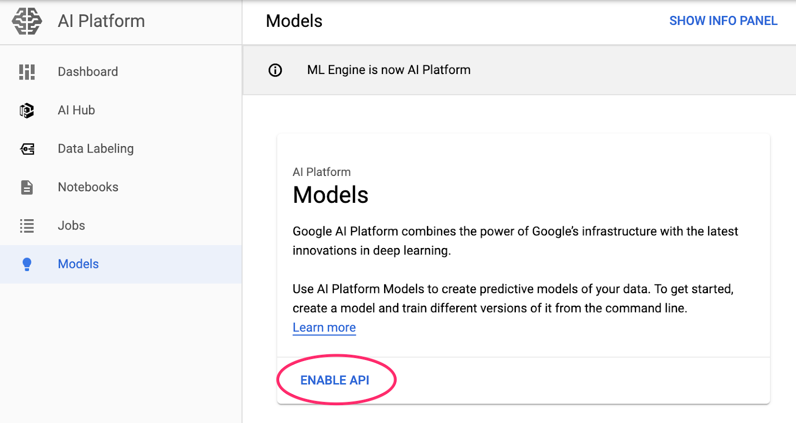
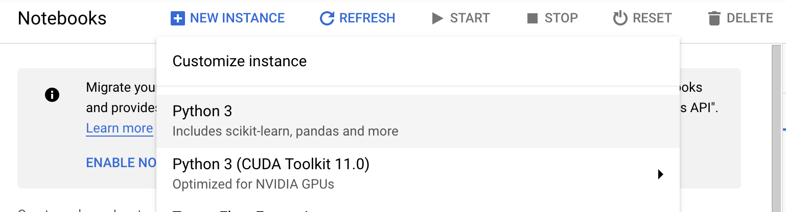
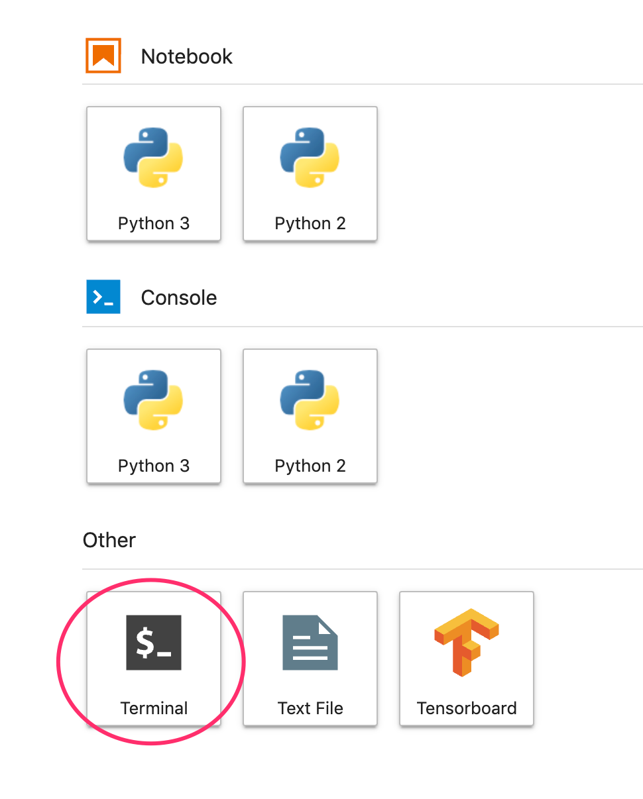
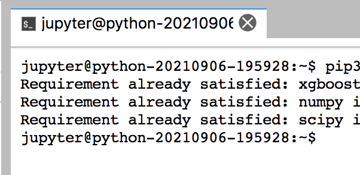
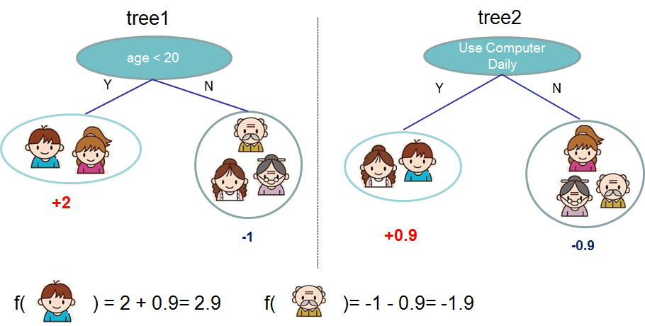
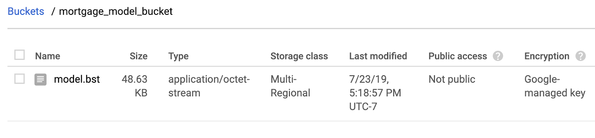
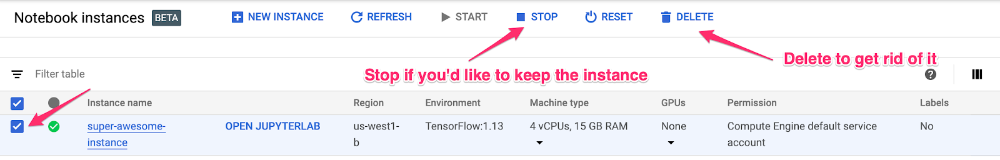

# Ungraded Lab (Optional): Build, train, and deploy an XGBoost model on Cloud AI Platform

In this **optional** tutorial, you will go through the same steps shown in the previous screencast. You will train an XGBoost model then see how you can use a managed service to deploy and serve this model in Google Cloud Platform (GCP). This is based on the Codelabs provided [here](https://codelabs.developers.google.com/codelabs/xgb-caip-e2e#0) and we updated some parts for clarity.

This exercise requires a GCP account but don't worry if you don't have one. You will be using the same tools in the course assignements and you will get free usage of GCP in those labs. You already saw how to use the tool in the screencast and you will get more hands on with it in next week's assignments. 

Alternatively, if you don't have a Google Cloud Platform (GCP) account yet, you can get a free trial by clicking the `Get Started for Free` button [here](https://cloud.google.com/free). Within 24 hours, you will get 300USD free credits and this exercise will just take 1USD (or less) of that total amount. Just take note of the cleanup instructions mentioned in the last bullet point below to delete all resources you've created in the tutorial. That should prevent recurring costs. Once you have it setup and you have your free credits, you can go to the [Cloud Console](https://console.cloud.google.com/) to start the lab.

## 1: Overview
<details>
<summary>Click here to expand!</summary>

In this lab, you will walk through a complete ML workflow on GCP. From a Cloud AI Platform Notebooks environment, you'll ingest data from a BigQuery public dataset, build and train an XGBoost model, and deploy the model to AI Platform for prediction.

You'll learn how to:

* Ingest and analyze a BigQuery dataset in AI Platform Notebooks
* Build an XGBoost model
* Deploy the XGBoost model to AI Platform and get predictions
* The total cost to run this lab on Google Cloud is about $1.

*Tip: It is best to have at least two windows open when going through the instructions in this tutorial: at least one for navigating to the different parts of GCP (e.g. Storage, BigQuery, AI Platform Models) and one for the AI Platform Jupyter Notebook you will open in Step 2 below.*

</details>

## 2 : Setup Your Environment
<details>
<summary>Click here to expand!</summary>

You'll need a Google Cloud Platform project to run this exercise. If you just enabled a GCP free trial, you should already have a project called 'My First Project'. If not, you can follow the [instructions here](https://cloud.google.com/resource-manager/docs/creating-managing-projects) to create a project.

**Step 1**: Enable the Cloud AI Platform Models API

Navigate to the [AI Platform Models](https://console.cloud.google.com/ai-platform/models) section of your Cloud Console and click Enable if it isn't already enabled.



**Step 2**: Enable the [Compute Engine API](https://console.cloud.google.com/marketplace/details/google/compute.googleapis.com)

Navigate to `Compute Engine` and select `Enable` if it isn't already enabled. You'll need this to create your notebook instance. (*tip: After clicking Enable and it doesn't automatically refresh, you can just manually refresh the page after a minute to see if the API has been enabled. It should show "API Enabled".*

**Step 3**: Create an AI Platform Notebooks instance

Navigate to [AI Platform Notebooks](https://console.cloud.google.com/mlengine/notebooks/instances) section of your Cloud Console and click *New Instance*. Then select the latest *Python* instance type:



Use the default options and then click *Create*. Once the instance has been created, select *Open JupyterLab*.

**Step 4**: Install XGBoost

Once your JupyterLab instance has opened, you'll need to add the XGBoost package.

To do this, select Terminal from the launcher:



Then run the following to install the latest version of XGBoost supported by AI Platform:

```
pip3 install xgboost==1.4.2
```

After this completes, close the Terminal (`x` on the upper right) to go back to the Launcher: 



From there, you can open a `Python 3` Notebook instance. You're ready to get started in your notebook!

**Step 5**: Import Python packages

*For the rest of this codelab, run all the code snippets from your Jupyter notebook.*

In the first cell of your notebook, add the following imports and run the cell. You can run it by pressing the right arrow button in the top menu or pressing command-enter:

```
import pandas as pd
import xgboost as xgb
import numpy as np

from sklearn.model_selection import train_test_split
from sklearn.utils import shuffle
from google.cloud import bigquery
```
</details>

## 3 : Exploring the BigQuery dataset
<details>
<summary>Click here to expand!</summary>

BigQuery has made [many datasets](https://cloud.google.com/bigquery/public-data) publicly available for your exploration. For this lab, we'll be using the [natality dataset](https://console.cloud.google.com/bigquery?p=bigquery-public-data&d=samples&t=natality&page=table&_ga=2.91160473.24786528.1580741008-413280468.1556849151). This contains data on nearly every birth in the US over a 40 year time period, including the birth weight of the child, and demographic information on the baby's parents. You'll be using a subset of the features to predict a baby's birth weight.

**Step 1**: Download the BigQuery data to our notebook

You'll be using the Python client library for BigQuery to download the data into a Pandas DataFrame. The original dataset is 21GB and contains 123M rows. To keep things simple we'll only be using 10,000 rows from the dataset.

Construct the query and preview the resulting DataFrame with the following code. Here we're getting 4 features from the original dataset, along with baby weight (the thing our model will predict). The dataset goes back many years but for this model we'll use only data from after 2000:

```
query="""
SELECT
  weight_pounds,
  is_male,
  mother_age,
  plurality,
  gestation_weeks
FROM
  publicdata.samples.natality
WHERE year > 2000
LIMIT 10000
"""
df = bigquery.Client().query(query).to_dataframe()
df.head()
```

*If you get a `403 Forbidden` error, it means you will need to enable the `BigQuery API` for your account. Search for `BigQuery` in the Search Bar and click `Enable API`. Kindly wait for it to be enabled before re-running the command above.*

To get a summary of the numeric features in our dataset, run:

```
df.describe()
```

This shows the mean, standard deviation, minimum, and other metrics for our numeric columns. Finally, let's get some data on our boolean column indicating the baby's gender. We can do this with Pandas' `value_counts` method:

```
df['is_male'].value_counts()
```
Looks like the dataset is nearly balanced 50/50 by gender.
</details>

## 4 : Prepare Data for Training
<details>
<summary>Click here to expand!</summary>

In this section, we'll divide the data into train and test sets to prepare it for training our model.

**Step 1**: Extract the label column

First drop rows with null values from the dataset and shuffle the data:

```
df = df.dropna()
df = shuffle(df, random_state=2)
```

Next, extract the label column into a separate variable and create a DataFrame with only our features:

```
labels = df['weight_pounds']
data = df.drop(columns=['weight_pounds'])
```

Now if you preview our dataset by running `data.head()`, you should see the four features we'll be using for training.

**Step 2**: Convert categorical features to integers

Since XGBoost requires all data to be numeric, we'll need to change how we're representing the data in the `is_male` column, which is currently True / False strings. We can do that simply by changing the type of that column:

```
data['is_male'] = data['is_male'].astype(int)
```

**Step 3**: Split data into train and test sets

We'll use Scikit Learn's `train_test_split` utility which we imported at the beginning of the notebook to split our data into train and test sets:

```
x,y = data,labels
x_train,x_test,y_train,y_test = train_test_split(x,y)
```

Now we're ready to build and train our model!
</details>

## 5 : A quick XGBoost primer
<details>
<summary>Click here to expand!</summary>

[XGBoost](https://github.com/dmlc/xgboost) is a machine learning framework that uses [decision trees](https://en.wikipedia.org/wiki/Decision_tree_learning) and [gradient boosting](https://en.wikipedia.org/wiki/Gradient_boosting) to build predictive models. It works by ensembling multiple decision trees together based on the score associated with different leaf nodes in a tree.

The diagram below is a simplified visualization of an ensemble tree network for a model that evaluates whether or not someone will like a specific computer game (this is from the [XGBoost docs](https://xgboost.readthedocs.io/en/latest/tutorials/model.html)):



Why are we using XGBoost for this model? While traditional neural networks have been shown to perform best on unstructured data like images and text, decision trees often perform extremely well on structured data like the birth weight dataset we'll be using.
</details>

## 6 : Build, train, and evaluate an XGBoost model
<details>
<summary>Click here to expand!</summary>

**Step 1**: Define and train the XGBoost model
Creating a model in XGBoost is simple. We'll use the `XGBRegressor` class to create the model, and just need to pass the right `objective` parameter for our specific task. Here we're using a regression model since we're predicting a numerical value (baby's weight). If we were instead bucketing our data to determine if a baby weighed more or less than 6 pounds, we'd use a classification model.

In this case we'll use `reg:squarederror` as our model's objective.

The following code will create an XGBoost model:

```
model = xgb.XGBRegressor(
    objective='reg:squarederror'
)
```

You can train the model with one line of code, calling the fit() method and passing it the training data and labels.

```
model.fit(x_train, y_train)
```

**Step 2**: Evaluate your model on test data

We can now use our trained model to generate predictions on our test data with the `predict()` function:

```
y_pred = model.predict(x_test)
```

Let's see how the model performed on the first 20 values from our test set. Below we'll print the predicted baby weight along with the actual baby weight for each test example:

```
for i in range(20):
    print('Predicted weight: ', y_pred[i])
    print('Actual weight: ', y_test.iloc[i])
    print()
```

**Step 3**: Save your model
In order to deploy the model, run the following code to save it to a local file:

```
model.save_model('model.bst')
```
</details>

## 7 : Deploy model to Cloud AI Platform
<details>
<summary>Click here to expand!</summary>

We've got our model working locally, but it would be nice if we could make predictions on it from anywhere (not just this notebook!). In this step we'll deploy it to the cloud.

**Step 1**: Create a Cloud Storage bucket for our model

Let's first define some environment variables that we'll be using throughout the rest of the tutorial. Fill in the values below with your PROJECT ID, the name of the cloud storage bucket you'd like to create (must be globally unique, you can use the project id as well), and the version name for the first version of your model.

*Tip: You can get the Project ID as shown by Laurence in the screencast or by running this command in a cell: `!gcloud config list project --format "value(core.project)"`. You can use the result to fill in `<YOUR_PROJECT_ID>` below:*

```
# Update these to your own GCP project, model, and version names
GCP_PROJECT = '<YOUR_PROJECT_ID>'
MODEL_BUCKET = 'gs://<YOUR_PROJECT_ID>'
VERSION_NAME = 'v1'
MODEL_NAME = 'baby_weight'
```

Now we're ready to create a storage bucket to store our XGBoost model file. We'll point Cloud AI Platform at this file when we deploy.

Run this `gsutil` command from within your notebook to create a bucket:

```
!gsutil mb $MODEL_BUCKET
```

**Step 2**: Copy the model file to Cloud Storage

Next, we'll copy our XGBoost saved model file to Cloud Storage. Run the following gsutil command:

```
!gsutil cp ./model.bst $MODEL_BUCKET
```

*If you get errors about creating buckets, you may need to enable the `Cloud Storage API` before retrying the command above. Just search for `Cloud Storage` using the Search Bar then click `Enable API`.*

Head over to the storage browser in your Cloud Console to confirm the file has been copied:



**Step 3**: Create and deploy the model

The following ai-platform gcloud command will create a new model in your project:

```
!gcloud ai-platform models create $MODEL_NAME --region=us-central1
```

Now it's time to deploy the model. We can do that with this gcloud command:

```
!gcloud ai-platform versions create $VERSION_NAME \
--model=$MODEL_NAME \
--framework='XGBOOST' \
--runtime-version=2.5 \
--origin=$MODEL_BUCKET \
--python-version=3.7 \
--project=$GCP_PROJECT \
--region=us-central1
```

While this is running, check the [models section](https://console.cloud.google.com/ai-platform/models) of your AI Platform console. You should see your new version deploying there:


When the deploy completes successfully you'll see a green check mark where the loading spinner is. The deployment can take up to 5 minutes.

**Step 4**: Test the deployed model

To make sure your deployed model is working, test it out using gcloud to make a prediction. First, save a JSON file with two examples from our test set:

```
%%writefile predictions.json
[0.0, 33.0, 1.0, 27.0]
[1.0, 26.0, 1.0, 40.0]
```

Test your model by saving the output of the following gcloud command to a variable and printing it:

```
prediction = !gcloud ai-platform predict --model=$MODEL_NAME --json-instances=predictions.json --version=$VERSION_NAME
print(prediction.s)
```

You should see your model's prediction in the output. The actual baby weight for these two examples is around 2 and 8 pounds respectively (results may differ slightly because we shuffled our dataset).
</details>

## 8 : Cleanup
<details>
<summary>Click here to expand!</summary>

If you'd like to continue using this notebook, it is recommended that you turn it off when not in use. From the Notebooks UI in your Cloud Console, select the notebook and then select Stop:



If you'd like to delete all resources you've created in this lab, simply delete the notebook instance instead of stopping it.

Using the Navigation menu in your Cloud Console, browse to `Cloud Storage` and delete both buckets you created to store your model assets. Similarly, you can also go to the dashboard of `AI Platform -> Models` to delete the model manually.

</details>
