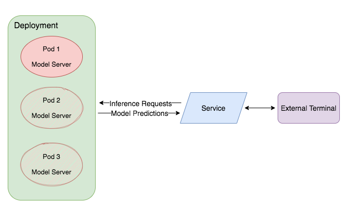
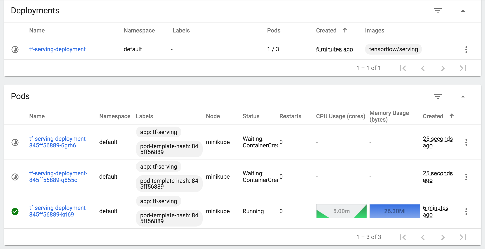

# Ungraded Lab: Practice Kubernetes in your Local Environment

In the previous reading item, you went through the basics of Kubernetes by doing imperative commands in the interactive shell (i.e. with `kubectl`). It shows how this tool can be used to orchestrate containers to host an application. If you haven't done that exercise, we highly encourage you to go back because we will assume that you are already familiar with the concepts discussed in [those 6 modules](https://kubernetes.io/docs/tutorials/kubernetes-basics/). This lab will be an extension of that activity and will show a few more concepts to prepare you for this week's graded assignment. Specifically, you will:

* setup Kubernetes in your local machine for learning and development
* create Kubernetes objects using YAML files
* deploy containers running a Tensorflow model server
* access the deployment using a Nodeport service
* autoscale the deployment to dynamicaly handle incoming traffic 

You should be able to run all the commands using Mac and Linux (tested on Ubuntu) CLI, Windows Powershell (run as Administrator) and Git Bash. In case you have limited resources or can't install in your workstation, don't worry about it. You can still refer to this document later and we'll show the expected output at each step.

## Installation

First, you will setup your machine to run a local Kubernetes cluster. This gives you more freedom to tweak settings and implement more features compared to the online Katacoda environment you used in the Kubernetes tutorial. It's a great tool for learning and for local development as well. There are several Kubernetes distributions and the one best suited for our purpose is [Minikube](https://minikube.sigs.k8s.io/docs/). You might remember it being mentioned in the first module of the Kubernetes basics exercise.

*Note: If you installed Docker for Desktop in the previous ungraded labs, you may have noticed that it also has a Kubernetes Engine that can be enabled in the Settings. At the moment, we found some limitations for it in some OS and it needs more tweaking or workarounds to make all the exercises here work. Thus, we recommend using Minikube for a more seamless experience.*

You will need to install the following tools to go through this lab:

* **curl** - a command-line tool for transferring data using various network protocols. You may have a already installed this in the Docker ungraded lab but in case you haven't, [here is one reference](https://reqbin.com/Article/InstallCurl) to do so. You will use this to query your model later.

* **Virtualbox** - Minikube is meant to run in a virtual machine (VM) so you will need virtualization software to act as the VM driver. While you can also specify `docker` as the VM driver, we found that it has limitations so it's best to use Virtualbox instead. Installation instructions can be found [here](https://www.virtualbox.org/wiki/Downloads). When prompted by your OS, make sure to allow network traffic for this software so you won't have firewall issues later on.

* **kubectl** - the command line tool for interacting with Kubernetes clusters. Installation instructions can be found [here](https://kubernetes.io/docs/tasks/tools/)

* **Minikube** - a Kubernetes distribution geared towards new users and development work. It is not meant for production deployments however since it can only run a single node cluster on your machine. Installation instructions [here](https://minikube.sigs.k8s.io/docs/start/).

<details>
<summary> <i>Windows Users: Please click here for additional notes. </i></summary>

1. Make sure that the directories to the `curl` and `kubectl` binaries are setup in your system `PATH` (or `Path`). That will allow you to execute these in the command line from any directory. Instructions can be found [here](https://www.computerhope.com/issues/ch000549.htm) in case you need to review how this is done.
2. You may need to append a `.exe` in the commands later to make use of `curl` and `kubectl`. For example, if you see `curl --help`, please do `curl.exe --help` instead.
3. In case you have [Git for Windows](https://git-scm.com/download/win) setup in your machine, then you can use the `Git Bash` CLI bundled with that package instead of `Windows Powershell`. Just search for it in the Search Bar to see if it is already in your system. That CLI runs like a Linux terminal so most of the commands in the next sections will run as is. But we still placed instructions in case you can only use Powershell.
4. If you encounter errors about running VirtualBox alongside WSL2 similar to [this](https://github.com/MicrosoftDocs/WSL/issues/798), you can fallback to using Docker as the VM runtime for Minikube. Instructions are shown in the next sections in case you follow this path.
---
</details>
</br>

## Architecture

The application you'll be building will look like the figure below:



You will create a deployment that spins up containers that runs a model server. In this case, that will be from the `tensorflow/serving` image you already used in the previous labs. The deployment can be accessed by external terminals (i.e. your users) through an exposed service. This brings inference requests to the model servers and responds with predictions from your model.

Lastly, the deployment will spin up or spin down pods based on CPU utilization. It will start with one pod but when the load exceeds a pre-defined point, it will spin up additional pods to share the load.

## Start Minikube

You are now almost ready to start your Kubernetes cluster. There is just one more additional step. As mentioned earlier, Minikube runs inside a virtual machine. That implies that the pods you will create later on will only see the volumes inside this VM. Thus, if you want to load a model into your pods, then you should first mount the location of this model inside Minikube's VM. Let's set that up now.

You will be using the `half_plus_two` model that you saw in earlier ungraded labs. You can copy it to your `/var/tmp` directory (Mac, Linux) or `C:/tmp` (Windows) so we'll have a common directory to mount to the VM. You can use the command below for Mac and Linux:

```
cp -R ./saved_model_half_plus_two_cpu /var/tmp
```

If you're using Windows (not WSL), then you can use the GUI to create a `tmp` folder under your `C:` drive then copy the folder there. You should have a `C:/tmp/saved_model_half_plus_two_cpu` folder as a result

Now you're ready to start Minikube! Run the command below to initialize the VM with Virtualbox and mount the folder containing your model file:

For Mac and Linux:

```
minikube start --mount=True --mount-string="/var/tmp:/var/tmp" --vm-driver=virtualbox
```

For Windows:

```
minikube start --mount=True --mount-string="C:/tmp:/var/tmp" --vm-driver=virtualbox
```

<details>
<summary> <i>Troubleshooting: Please click here if you're getting errors with these commands. </i></summary>

Some learners reported prompts about driver errors and thus, they can't make Virtualbox the VM driver when launching Minikube. In case you run into the same issue and can't resolve it, you can just fallback to Docker:

```
minikube start --mount=True --mount-string="C:/tmp:/var/tmp" --vm-driver=docker
```

This would require revisions to some of the commands later and we placed that in *Troubleshooting* sections as well.

---

</details>
</br>


## Creating Objects with YAML files

In the official Kubernetes basics tutorial, you mainly used `kubectl` to create objects such as pods, deployments, and services. While this definitely works, your setup will be more portable and easier to maintain if you configure them using [YAML](https://yaml.org/spec/1.2/spec.html) files. We've included these in the `yaml` directory of this ungraded lab so you can peruse how these are constructed. The [Kubernetes API](https://kubernetes.io/docs/reference/kubernetes-api/) also documents the supported fields for each object. For example, the API for Pods can be found [here](https://kubernetes.io/docs/reference/kubernetes-api/workload-resources/pod-v1/).

One way to generate this when you don't have a template to begin with is to first use the `kubectl` command then use the `-o yaml` flag to output the YAML file for you. For example, the [kubectl cheatsheet](https://kubernetes.io/docs/reference/kubectl/cheatsheet/) shows that you can generate the YAML for a pod running an `nginx` image with this command:

```
kubectl run nginx --image=nginx --dry-run=client -o yaml > pod.yaml
```

All objects needed for this lab are already provided and you are free to modify them later when you want to practice different settings. Let's go through them one by one in the next sections.

### Config Maps

First, you will create a [config map](https://kubernetes.io/docs/concepts/configuration/configmap/) that defines a `MODEL_NAME` and `MODEL_PATH` variable. This is needed because of how the `tensorflow/serving` image is configured. If you look at the last layer of the docker file [here](https://hub.docker.com/layers/tensorflow/serving/2.6.0/images/sha256-7e831f11c9ef928c09b4064a059066484079ac819991f162a938de0ad4b0fbd5?context=explore), you'll see that it runs a `/usr/bin/tf_serving_entrypoint.sh` script when it starts the container. That script just contains this command it and it should look familiar from the previous ungraded labs:

```
#!/bin/bash 

tensorflow_model_server --port=8500 --rest_api_port=8501 --model_name=${MODEL_NAME} --model_base_path=${MODEL_BASE_PATH}/${MODEL_NAME} "$@"
```

It basically starts up the model server and uses the environment variables `MODEL_BASE_PATH` and `MODEL_NAME` to find the model. Though you can explicitly define this as well in the `Deployment` YAML file, it would be more organized to have it in a configmap so you can plug it in later. Please open `yaml/configmap.yaml` to see the sytax.

You can create the object now using `kubectl` as shown below. Notice the `-f` flag to specify a filename. You can also specify a directory but we'll do that later.

```
kubectl apply -f yaml/configmap.yaml
```

With that, you should be able to `get` and `describe` the object as before. For instance, `kubectl describe cm tfserving-configs` should show you:

```
Name:         tfserving-configs
Namespace:    default
Labels:       <none>
Annotations:  <none>

Data
====
MODEL_PATH:
----
/models/half_plus_two
MODEL_NAME:
----
half_plus_two
Events:  <none>
```

### Create a Deployment

You will now create the deployment for your application. Please open `yaml/deployment.yaml` to see the spec for this object. You will see that it starts up one replica, uses `tensorflow/serving` as the container image and defines environment variables via the `envFrom` tag. It also exposes port `8501` of the container because you will be sending HTTP requests to it later on. It also defines cpu and memory limits and mounts the volume from the Minikube VM to the container.

As before, you can apply this file to create the object:

```
kubectl apply -f yaml/deployment.yaml
```

Running `kubectl get deploy` after around 90 seconds should show you something like below to tell you that the deployment is ready.

```
NAME                    READY   UP-TO-DATE   AVAILABLE   AGE
tf-serving-deployment   1/1     1            1           15s
```

### Expose the deployment through a service

As you learned in the Kubernetes tutorial before, you will need to create a service so your application can be accessible outside the cluster. We've included `yaml/service.yaml` for that. It defines a [NodePort](https://kubernetes.io/docs/concepts/services-networking/service/#nodeport) service which exposes the node's port 30001. Requests sent to this port will be sent to the containers' specified `targetPort` which is `8501`. 

Please apply `yaml/service.yaml` and run `kubectl get svc tf-serving-service`. You should see something like this:

```
NAME                 TYPE       CLUSTER-IP    EXTERNAL-IP   PORT(S)          AGE
tf-serving-service   NodePort   10.103.30.4   <none>        8501:30001/TCP   27s
```

You can try accessing the deployment now as a sanity check. The following `curl` command will send a row of inference requests to the Nodeport service:

```
curl -d '{"instances": [1.0, 2.0, 5.0]}' -X POST $(minikube ip):30001/v1/models/half_plus_two:predict
```

If the command above does not work, you can run `minikube ip` first to get the IP address of the Minikube node. It should return a local IP address like `192.168.99.102` (If you see `127.0.0.1`, please see the troubleshooting sections below). You can then plug this in the command above by replacing the `$(minikube ip)` string. For example:

```
curl -d '{"instances": [1.0, 2.0, 5.0]}' -X POST http://192.168.99.102:30001/v1/models/half_plus_two:predict
```

<details>
<summary> <i> Troubleshooting: Click here if you are using Powershell and have VirtualBox as the VM driver </i> </summary>

First, make sure that you have setup `curl` in your system `PATH` as mentioned in the curl installation instructions. Then run this command:

```
curl.exe -d '{\"instances\": [1.0, 2.0, 5.0]}' -X POST "$(minikube ip):30001/v1/models/half_plus_two:predict"
```

The changes compared to the Mac/Linux command are:

* use `curl.exe` to avoid confusion with the Windows built-in `curl`. The latter is an alias for `Invoke-WebRequest`. This also implies that you’ve added the curl path to your PATH as mentioned in the curl installation instructions.

* the additional `\` in the `instances` string, as well as the additional `"` in the POST URL are needed so Powershell can parse it correctly

---
</details>
<br>

<details>
<summary> <i> Troubleshooting: Click here if you used Docker instead of Virtualbox as the VM runtime </i> </summary>

You will most likely get a refused connection here because the network is not yet setup. To get around that, please run this command in a separate window: `minikube service tf-serving-service`. You will see an output like below 

```
|-----------|--------------------|----------------------|---------------------------|
| NAMESPACE |        NAME        |     TARGET PORT      |            URL            |
|-----------|--------------------|----------------------|---------------------------|
| default   | tf-serving-service | tf-serving-http/8501 | http://192.168.20.2:30001 |
|-----------|--------------------|----------------------|---------------------------|
🏃  Starting tunnel for service tf-serving-service.
|-----------|--------------------|-------------|------------------------|
| NAMESPACE |        NAME        | TARGET PORT |          URL           |
|-----------|--------------------|-------------|------------------------|
| default   | tf-serving-service |             | http://127.0.0.1:60473 |
|-----------|--------------------|-------------|------------------------|
```

This opens a tunnel to your service with a random port. Grab the URL at the bottom right box and use it in the curl command like this in Linux/Mac:

```
curl -d '{"instances": [1.0, 2.0, 5.0]}' -X POST http://127.0.0.1:60473/v1/models/half_plus_two:predict
```

or in Windows:

```
curl.exe -d '{\"instances\": [1.0, 2.0, 5.0]}' -X POST http://127.0.0.1:60473/v1/models/half_plus_two:predict
```
---

</details>
<br>

If the command is successful, you should see the results returned by the model:

```
{
    "predictions": [2.5, 3.0, 4.5
    ]
}
```

Great! Your application is successfully running and can be accessed outside the cluster!

### Horizontal Pod Autoscaler

As mentioned in the lectures, one of the great advantages of container orchestration is it allows you to scale your application depending on user needs. Kubernetes provides a [Horizontal Pod Autoscaler (HPA)](https://kubernetes.io/docs/tasks/run-application/horizontal-pod-autoscale/) to create or remove replicasets based on observed metrics. To do this, the HPA queries a [Metrics Server](https://kubernetes.io/docs/tasks/debug-application-cluster/resource-metrics-pipeline/#metrics-server) to measure resource utilization such as CPU and memory. The Metrics Server is not launched by default in Minikube and needs to be enabled with the following command:

```
minikube addons enable metrics-server
```

You should see a prompt saying `🌟  The 'metrics-server' addon is enabled
` shortly. This launches a `metrics-server` deployment in the `kube-system` namespace. Run the command below and wait for the deployment to be ready.

```
kubectl get deployment metrics-server -n kube-system
```

You should see something like:

```
NAME             READY   UP-TO-DATE   AVAILABLE   AGE
metrics-server   1/1     1            1           76s
```

With that, you can now create your autoscaler by applying `yaml/autoscale.yaml`. Please wait for about a minute so it can query the metrics server. Running `kubectl get hpa` should show: 

```
NAME             REFERENCE                          TARGETS   MINPODS   MAXPODS   REPLICAS   AGE
tf-serving-hpa   Deployment/tf-serving-deployment   0%/2%    1         3         1          38s

```

If it's showing `Unknown` instead of `0%` in the `TARGETS` column, you can try sending a few curl commands as you did earlier then wait for another minute.


### Stress Test


To test the autoscaling capability of your deployment, we provided a short bash script (`request.sh`) that will just persistently send requests to your application. Please open a new terminal window, make sure that you're in the root directory of this README file, then run this command (for Linux and Mac):

```
/bin/bash request.sh
```

<details>
<summary> <i>Troubleshooting: Click here if you used Docker as the VM driver instead of VirtualBox </i></summary>

If you are using a minikube tunnel for the `tf-serving-service`, then you need to modify the bash script to match the URL that you are using. Please open `request.sh` in a text editor and change `$(minikube ip)` to the URL specified in the `minikube tunnel` command earlier. For example:

```
#!/bin/bash

while sleep 0.01;

do curl -d '{"instances": [1.0, 2.0, 5.0]}' -X POST http://127.0.0.1:60473/v1/models/half_plus_two:predict;

done
``` 
---

</details>
</br>

<details>
<summary><i>Troubleshooting: Click here if you are using Windows Powershell</i></summary>

You will need a different script for Powershell. Please do these steps to run it:

1 - Please run this command in Powershell to see if scripting is enabled:

```
Get-ExecutionPolicy
```

Please remember the output value so you can set it back after the exercise. If you haven't scripted before, it is most likely set to `Restricted`.

2 - Enable scripting with this command:

```
Set-ExecutionPolicy RemoteSigned
```

3 - With that, you should be able run the script in Powershell with:

```
./request.ps1
```

4 - When you’re done with the entire exercise, you can revert to the original ExecutionPolicy in step 1 (e.g. `Set-ExecutionPolicy Restricted`).

---
</details>
<br>


You should see results being printed in quick succession:

```
{
    "predictions": [2.5, 3.0, 4.5
    ]
}{
    "predictions": [2.5, 3.0, 4.5
    ]
}{
    "predictions": [2.5, 3.0, 4.5
    ]
}{
    "predictions": [2.5, 3.0, 4.5
    ]
}{
    "predictions": [2.5, 3.0, 4.5
    ]
}{
    "predictions": [2.5, 3.0, 4.5
    ]
}{
    "predictions": [2.5, 3.0, 4.5
    ]
}{
    "predictions": [2.5, 3.0, 4.5
    ]
}{

```

If you're seeing connection refused, make sure that your service is still running with `kubectl get svc tf-serving-service`.


There are several ways to monitor this but the easiest would be to use Minikube's built-in dashboard. You can launch it by running:

```
minikube dashboard
```

If you launched this immediately after you ran the request script, you should initially see a single replica running in the `Deployments` and `Pods` section:


After about a minute of running the script, you will observe that the CPU utilization will reach 5 to 6m. This is more than the 20% that we set in the HPA so it will trigger spinning up the additional replicas:



Finally, all 3 pods will be ready to accept request and will be sharing the load. See that each pod below shows `2.00m` CPU Usage.


You can now stop the `request.sh` script by pressing `Ctrl/Cmd + C`. Unlike scaling up, scaling down the number of pods will take longer before it is executed. You will wait around 5 minutes (where the CPU usage is below 1m) before you see that there is only one pod running again. This is the behavior for the `autoscaling/v1` API version we are using. There is already a `v2` in the beta stage being developed to override this behavior and you can read more about it [here](https://kubernetes.io/docs/tasks/run-application/horizontal-pod-autoscale/#api-object).

## Tear Down

After you're done experimenting, you can destroy the resources you created if you want. You can simply call `kubectl delete -f yaml` to delete all resources defined in the `yaml` folder. You should see something like this:

```
horizontalpodautoscaler.autoscaling "tf-serving-hpa" deleted
configmap "tfserving-configs" deleted
deployment.apps "tf-serving-deployment" deleted
service "tf-serving-service" deleted
```

You can then re-create them all next time with one command by running `kubectl apply -f yaml`. Just remember to check if `metrics-server` is enabled and running.

If you also want to destroy the VM, then you can run `minikube delete`. 

If you used Powershell, then you can disable scripting as mentioned in the instructions earlier.

## Wrap Up

In this lab, you got to practice more Kubernetes basics by using YAML configuration files and running the Tensorflow Serving container. This can be a baseline for you to start trying to serve your own models with an orchestration framework in mind. Most of the concepts here will be applicable to the Qwiklabs for this week so feel free to reference this document. Great job and on to the next part of the course!

