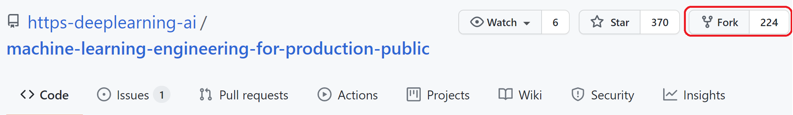
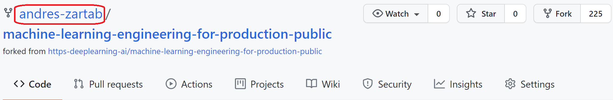

# Week 3 Ungraded Lab: Intro to CI/CD pipelines with GitHub Actions

Welcome! During this lab you will take a look at how to use [GitHub Actions](https://github.com/features/actions) to automate your Machine Learning workflows. You will also perform some unit testing using [pytest](https://docs.pytest.org/en/6.2.x/) to evaluate changes to your code before deploying into production.

This lab is going to be different to the previous ones for several reasons:
- You will need to [fork](https://docs.github.com/en/get-started/quickstart/fork-a-repo) this repo so you can run GH actions on your own copy of the repo.

- You will need to edit the code by pasting snippets provided in this tutorial.
- You will push changes to your forked repo by using git commands. Don't worry if you are very familiar with git as all commands will be explained here.

Let's get started!

---

## What is GH Actions?

This is an amazing tool that allows you to define automatic workflows for specific events within a GH repo. For instance you can create Python script versions of all your Jupyter notebooks every time you push or pull changes from the remote repository.

In this lab you will set up an action that will run the unit tests defined for your code every time you push changes to the remote repo.

To give you an idea of the flexibility of this tool, you could also (although not covered in this lab) set the action to build a Docker image out of your code if all the unit tests were passed and sent that image to a Google Cloud Bucket where it can be used to deploy your code. This would mean that you successfully automated your deployment with every push of changes.


## Fork the public repo

Forking a repo is simply creating your own copy of it. It is often used in Open Source development as a way of keeping everything tidy. Instead of working directly on a public repo (in which you probably won't have writing access) you can work on your fork and submit Pull Requests from it. To fork a repo just click on the `Fork` button on the top right corner of the repo:




Once the forking process has been completed you should have a copy of the repo registered under your username, like this:



Now you need to clone it into your local machine. You can do so by using these commands (be sure to replace the username used here for your own):

```bash
git clone https://github.com/your-username/machine-learning-engineering-for-production-public.git
```

or for cloning via SSH use:
```bash
git clone git@github.com:your-username/machine-learning-engineering-for-production-public.git
```

If you are unsure which method to use for cloning, use the first one.

## Navigating the fork

Now `cd` into your fork. You can do so by using the command `cd machine-learning-engineering-for-production-public` while on the directory that contains your fork.

Before jumping to the directory with the files for this lab, notice a hidden folder in the root of the repo called `.github`. Within there is another directory called `workflows`, here is where all of the files for configuring Actions should be placed. These files should be in `YAML` format. In this case you should encounter a file called `course4-week3-lab.yml` that will be responsible for setting up your desired action of running unit tests. For convenience the contents of the file are placed here:

```yml
# Run unit tests for your Python application

name: C4W3-Ungraded-Lab

# Controls when the action will run. 
on:
  # Triggers the workflow on push request events only when there are changes in the desired path
  push:
    paths:
      - 'course4/week3-ungraded-labs/C4_W3_Lab_2_Github_Actions/**'

# A workflow run is made up of one or more jobs that can run sequentially or in parallel
jobs:
  # This workflow contains a single job called "test"
  test:
    # The type of runner that the job will run on
    runs-on: ubuntu-latest
    defaults:
      run:
        # Use bash as the shell
        shell: bash
        # Specify the working directory for the workflow
        working-directory: course4/week3-ungraded-labs/C4_W3_Lab_2_Github_Actions/

    # Steps represent a sequence of tasks that will be executed as part of the job
    steps:
      -
        name: Checkout
        uses: actions/checkout@v2
      - 
        name: Set up Python
        uses: actions/setup-python@v2
        with:
          python-version: '3.7.7'
      - 
        name: Install dependencies
        run: |
          python -m pip install --upgrade pip
          pip install numpy fastapi uvicorn scikit-learn pytest
      -
        name: Test with pytest
        run: |
          pytest
```

Wow that is a long file. Let's break it down piece by piece (notice that comments are trimmed to keep the snippets short but they also provide important information so be sure to read them if you don't understand something):

```yml
name: C4W3-Ungraded-Lab
on:
  push:
    paths:
      - 'course4/week3-ungraded-labs/C4_W3_Lab_2_Github_Actions/**'
```

In this first part you need to define a name for your Action so you can differentiate it from other ones. After this you need to specify what will trigger it, in this case the Action will be run automatically with a **push** that has changes to any file within the `course4/week3-ungraded-labs/C4_W3_Lab_2_Github_Actions` directory.

```yml
jobs:
  test:
    runs-on: ubuntu-latest
    defaults:
      run:
        shell: bash
        working-directory: course4/week3-ungraded-labs/C4_W3_Lab_2_Github_Actions/
```

In the next part you need to define all of the jobs than will run when this action is triggered. In this case you only need one job, which will be named `test` and will run in an environment that uses the latest release of Ubuntu. You can also define some default behavior for the job such as the desired shell, `bash` in this case, and the working directory within the repo. This means that the action will run as it had `cd` into the `course4/week3-ungraded-labs/C4_W3_Lab_2_Github_Actions/` directory first.

```yml
    steps:
      -
        name: Checkout
        uses: actions/checkout@v2
      - 
        name: Set up Python
        uses: actions/setup-python@v2
        with:
          python-version: '3.7.7'
      - 
        name: Install dependencies
        run: |
          python -m pip install --upgrade pip
          pip install -r requirements.txt
      -
        name: Test with pytest
        run: |
          cd app/
          pytest
```

Finally you need to specify the `steps` for this action to be completed. This is a sequence of commands to achieve the functionality you strive for.  `steps` have several values associated such as:
- `name`: The name of the step.

- `uses`: You can specify an already existing `Action` as an step on one of your own. This is pretty cool because it allows for reutilization of Actions. 
- `run`: Instead of using an existing Action you might need to run a command. Since you are using `bash` inside a Linux VM, these commands should follow the correct syntax.
- `with`: You might need to specify some additional values. This field is for such cases.


Let's understand every step in order:

- The first step uses the `actions/checkout@v2` Action. This is usually included in every Action since it allows GitHub to access or check-out your repo.

- Now that your repo has been checked-out, you need to set an environment capable of running your Python code. To accomplish this the `actions/setup-python@v2` Actions is used while specifying the desired Python version.
- Having a Python supported environment it is time to install of the dependencies that your application needs. You can do so by using upgrading `pip` and then using it to install the dependencies listed in the `requirements.txt` file.
- Finally you can run your unit tests by simply using the `pytest` command. Notice that you needed to `cd` into the `app` directory first.
