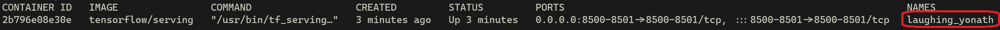

# Week 3 Ungraded Lab: Model versioning with Tensorflow Serving and Docker

Welcome! During this lab you will take a look at how to version models using TFS. This topic is very important because models usually change over time and you need a way to control the version that is live for most users while being able to work on newer versions. Other uses of this are canary deployment or A/B testing.

Before going forward make sure you have the `tensorflow/serving:latest` Docker image in your local machine. You can do so by using the `docker images` command. If the image does not appear in the list you can download it using the `docker pull tensorflow/serving` command. 

Open a terminal and `cd` into the directory that contains the files needed by this lab. Assuming you are on the root of the repo you can use the command `cd course4/week3-ungraded-labs/C4_W3_Lab_3_TFS_Model_Versioning`.

Let's get started!

----

## Download the models

During Course 1 of this specialization you trained a model to classify cats, dogs and birds with 3 different datasets resulting in 3 different models, these were:
- One with imbalanced classes
- One with balanced classes
- One with balanced classes and data augmentation

These models were saved using the `SavedModel` format so everyone has these files:
- `variables`: a directory containing information about the training checkpoints of the model.
- `saved_model.pb`: the protobuf file that represents the actual TF program.

To download these models into your local machine you can use the `setup.sh` file provided.

First you want to make it executable using the command:

```bash
chmod +x setup.sh
```

And to run it use:

```bash
./setup.sh
```

This process should not take longer than a minute. After it is completed the `models` directory should look like this:

```
models
    ├── models.config
    └── animals
        ├── 1/
        │   ├── variables/
        │   └── saved_model.pb
        ├── 2/
        │   ├── variables/
        │   └── saved_model.pb
        └── 3/
            ├── variables/
            └── saved_model.pb
```

In this case `animals` is the name of the model and every subdirectory within this directory represents a version of this model. **Notice that TFS expects the versioning to be done with integers and not strings.** 

By default, TFS serves whatever version of your model has the higher number since it is considered to be the latest version of it. This can be undesired in some cases so TFS also allows some flexibility through the `models.config` configuration file.

In this case the versioning works like this:

- Version 1: imbalanced classes
- Version 2: balanced classes
- Version 3: balanced classes and data augmentation


## Understanding `models.config`

You can specify the desired configuration for how you want TFS to host your model versions via the `models.config` file.

Let's take a look at the elements of this file:

```config
model_config_list {
  config {
    name: 'animals'
    base_path: '/models/animals/'
    model_platform: 'tensorflow'
  }
}
```

You will always have to have a structure similar to the one above. `model_config_list` should be defined in the outermost scope and within it you should specify a `config` scope for every model you want to host. In this case you only have one model so there is a single one. Within this scope you can see  values assigned to some variables, let's break it down:
- `name`: Stands for the name of your model. In this case it is `animals`.

- `base_path`: Stands for path where your model is going to be. Since you will use TFS with Docker you will set this path to `/models/animals/`.
- `model_platform`: Stands for the format of your model. In this case it is `tensorflow`.

Until now you have not provided any custom configuration but by adding more information to this file you can customize things like which versions of the model are going to be served. You will be serving the 3 versions so you will need to add this within the `config` scope:

```config
    model_version_policy {
        specific {
            versions: 1
            versions: 2
            versions: 3
          }
        }
```

Now all versions of the model will be served. This is cool but you still need to remember what every version is supposed to be. To account for this you can also define labels for each version by adding this:

```config
    version_labels {
        key: 'deprecated'
        value: 1
    }
    version_labels {
        key: 'stable'
        value: 2
    }
    version_labels {
        key: 'canary'
        value: 3
    }
```

Now that you assigned labels it is much easier to remember what every version represents:
- Version 1 was the first iteration of the model and yielded poor results and has been deprecated.

- Version 2 is the stable version of the classifier.
- Version 3 has some new features to yield better results than the stable version so it is used for canary deployment.

To check the whole file be sure to look at it within the `models` directory.


## Serving the models

Now that you understand how the configuration file works it is time to serve the models using TFS and Docker. You can do so using the `docker run` command as you saw on a past ungraded lab:

```bash
docker run -t --rm  -p 8501:8501 \
--mount type=bind,source="$(pwd)/models",target=/models/ tensorflow/serving \
--model_config_file=/models/models.config \
--model_config_file_poll_wait_seconds=60 \
--allow_version_labels_for_unavailable_models=true
```

By now you should understand the meaning of the `-t`, `--rm`, `-p` and `--mount` flags. In case you need a refresh let's revisit them:
- `-t`: Attaches a pseudo-terminal to the container so you can check what is being printed in the standard streams of the container. This will allow you to see the logs printed out by TFS.


- `--rm`: Delete this container after stopping running it. This is to avoid having to manually delete the container. Deleting unused containers helps your system to stay clean and tidy.
- `-p 8501:8501`: Maps port 8501 within the container to port 8501 in your machine.
- `--mount type=bind,source="$(pwd)/models",target=/models/` : This flag allows you to mount a directory in your pc to a directory within the container. In this case this is done because you need TFS to have access to your model and config files within the container but you want to avoid creating a new image that already has those files.

All of these are Docker flags but what about the ones after the image name? These are TFS flags and because of this they need to be specified after the image name. Those you haven't seen in a previous lab so let's break them down:

- `--model_config_file`: This flag expects the path of the configuration file within the container. In this case the path is `/models/models.config`.

- `--model_config_file_poll_wait_seconds`: This flag controls how much time TFS will wait before checking for changes in the configuration file. In this case it is set to `60` seconds. This is specified so you can make changes to the config file and see the results.
- `--allow_version_labels_for_unavailable_models`: By default TFS does not allow labelling of models that are not ready to serve. So usually you had to avoid including the labels in the config file and spin up the container (otherwise you'll get an error) and after the models were loaded for serving you could edit the config file to include labels. By setting this flag to `true` you avoid having to do this.

After running the above command your models should be ready to be used for prediction. Nice job!


## Consuming the models

To test the different model versions you can use the `dog_example.json` file that is provided. This file contains an example of a dog image serialized as JSON.

Since you defined labels for the versions of the models you can consume them either by using numerical versioning or labels.

Begin by sending a `POST` request to version 1 of the model:

```bash
curl -X POST http://localhost:8501/v1/models/animals/versions/2:predict \
    -d @./dog_example.json \
    -H "Content-Type: application/json"
```

This request should provide a response that includes the `softmax` score for each of the classes. Remember that class 0 is for birds, 1 for cats and 2 for dogs.

Now ask for a prediction to the same model but this time using labels instead of versions. Notice that the URL changes slightly:

```bash
curl -X POST http://localhost:8501/v1/models/animals/labels/stable:predict \
    -d @./dog_example.json \
    -H "Content-Type: application/json"
```

Since the `stable` model is the same as `version 2` you should see the same values you got from the previous requests.

Now try out other versions and labels and see what you get. You can also try deleting version 1 from the config file and see how TFS will fail to load this model now.

## Stopping the server

Finally you will learn how to stop the server running within the Docker container. In this case to stop the container is equivalent to stopping the server, to do so, run the following command to see all of the running Docker processes (or containers):

```bash
docker ps
```
This will display some relevant information for each running docker process. If you want to also check this information for stopped containers use the flag `-a`.

Docker automatically assigns a unique name to each container and this can be seen with the above command which should yield an output similar to this:



To stop a container simply use the command:

```bash
docker stop container_name
```

In this case the command will be: 
```bash
docker stop laughing_yonath
```

After some seconds you should see that the process exited on the terminal that you spined up the container.


-----
**Congratulations on finishing this ungraded lab!**

Now you should have a better sense of how TFS and Docker can be leveraged to serve your Machine Learning models by providing you with the option to serve specific versions of those models. You also saw that although TFS uses numerical versioning by default, it allows you to set labels to each version so it is easier to keep track of what you are serving.


**Keep it up!**
